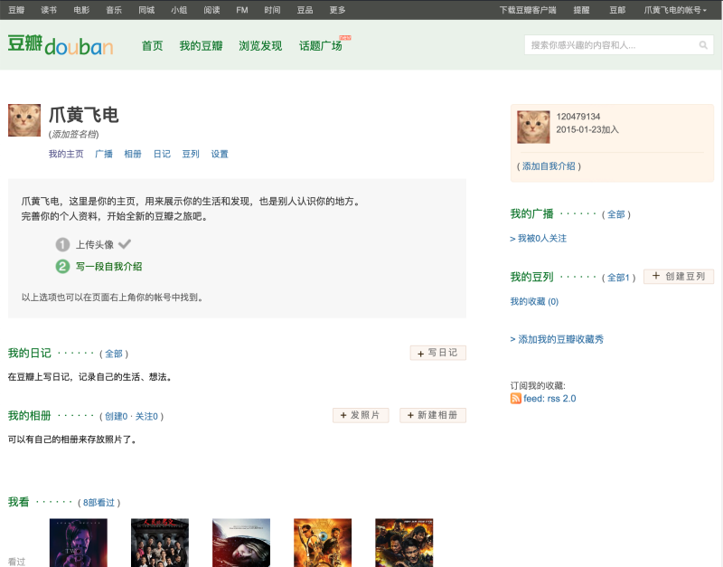
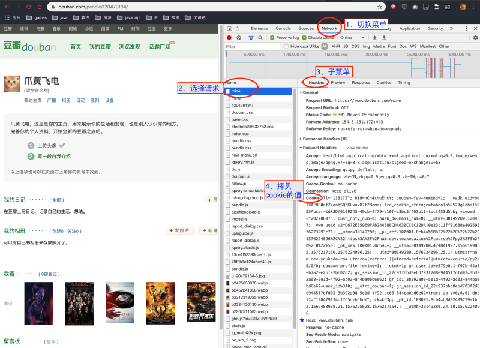
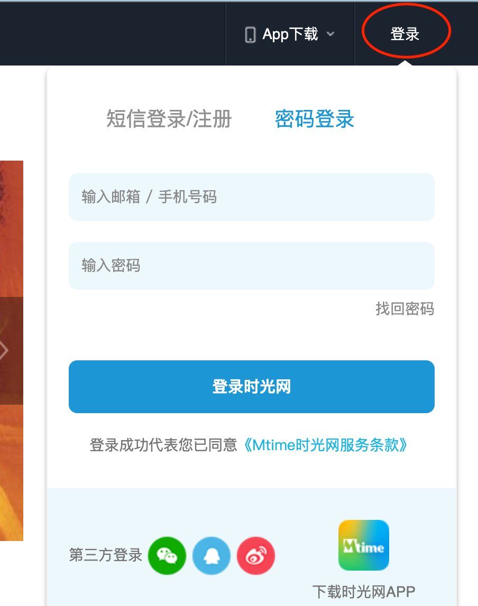
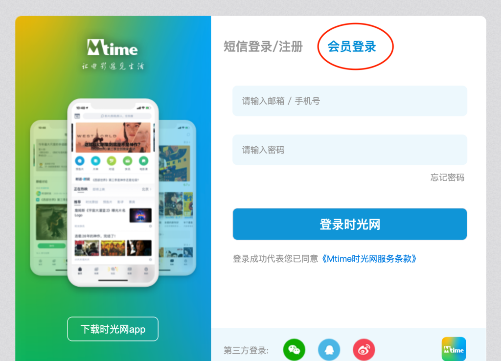
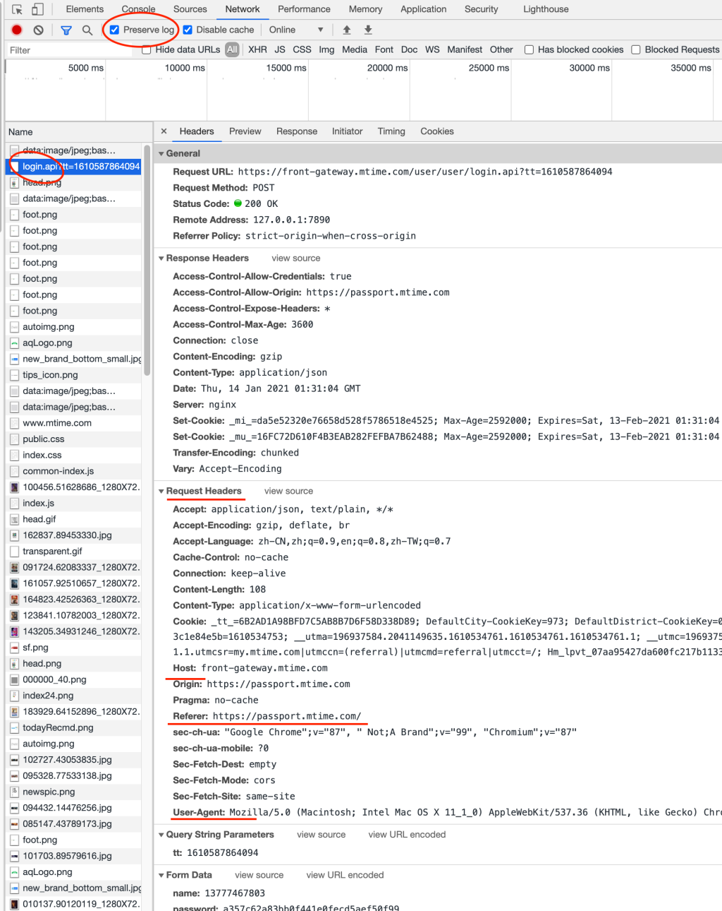

# API记录

## 什么是 API

API 全称 Application Programming Interface，应用程序接口，API 一般是指一些预先定义的函数，目的是可以为开发人员快速访问某一程序，而无需了解和访问源码，或理解它内部工作机制的细节。

简单的讲，**API 可以快速调用某个程序**。

这在计算机里叫做接口，我们生活中也有很多接口，比如 U 盘可以储存信息，我们访问 U 盘，只需要把 U 盘插到电脑上就可以访问，插入的 USB 接口就是一个接口，我们不需要关心它是如何实现的。

又比如电视机上有很多接口，有的连话筒，有的连视频，我们只需要直接插上对应的线就可以实现相应的功能，并不关心它的具体机制。

如果大家想要了解关于更多 `API` 的知识，可以点击查看这个[文档](https://ham.youkeda.com/articles/detail/5f3756bd5e205f30b2c2b125)

## 小笑话

```html
https://www.fastmock.site/mock/3d95acf3f26358ef032d8a23bfdead99/api/getJoke
```

## 查询手机号信息

使用手机信息查询的 `API` ，以 `POST`、`表单` 的方式查询自己的手机号信息：

```html
http://tcc.taobao.com/cc/json/mobile_tel_segment.htm
```

只有一个表单数据字段，名字为 `tel` ，值为自己的手机号：

完成程序，调用 `API` ，在 `console` 打印调用结果。

## 查询天气

我们看一个查询如杭州市余杭区天气 `API` ：

```
http://www.weather.com.cn/data/sk/101210106.html
```

## 查询 `IP` 地址信息的 `API` 

```
http://ip-api.com/json/?lang=zh-CN
```

我们只要把包含**参数**的完整的 `URL` 直接传入到方法中就可以了。

## 有音乐信息搜索的 `API` 

查询时参数指定了歌曲的名称：

```html
https://c.y.qq.com/soso/fcgi-bin/client_search_cp?aggr=1&cr=1&flag_qc=0&p=1&n=30&w=西海情歌&format=json
```

## 调用爱词霸字典的 `API` 

查询单词 `teacher` 的中文含义：

```html
http://dict-co.iciba.com/search.php?word=teacher&submit=查询
```

# 简单的API调用

首先，我们需要安装一个库： `Okhttp3`，这是一个非常流行的 `HTTP` 库，可以简单、快速的实现 `HTTP` 调用。

安装 `Okhttp3` 的方式是在 `pom.xml` 文件中增加依赖：

```xml
<!-- https://mvnrepository.com/artifact/com.squareup.okhttp3/okhttp -->
<dependency>
 <groupId>com.squareup.okhttp3</groupId>
 <artifactId>okhttp</artifactId>
 <version>4.1.0</version>
</dependency>
```

使用 `Okhttp3` 完成页面请求，需要三大步骤：

1. 实例化 `OkHttpClient`。使用 `OkHttpClient okHttpClient = new OkHttpClient();` 代码。20
2. 执行调用。
   1. 在执行调用之前，需要实例化一个 `Request` 对象，作用是定义请求的各种参数，`Request request = new Request.Builder().url(url).build();`
   2. 然后构建调用对象 `Call call = okHttpClient.newCall(request);`
   3. 最后执行调用，如果调用失败可能抛异常，所以必须抓取异常。`call.execute()` 就是执行调用的代码。
3. `call.execute()` 返回的其实是一个执行的结果对象，调用对象的方法即可获取返回的字符串内容：`call.execute().body().string();`8

演示的代码基本上都属于**固定写法**。2

> 任何时候都不要忘记 `pom.xml` 文件添加依赖，以及代码中使用 `import` 语句引入使用的类哦。

由于 `Java` 一切皆对象的理念，所以实际上代码量可能比大家想象的要大。

但是没关系，我们把调用的步骤封装在一个 `getContent()` 方法中，比较容易理解，也方便复用。大家不用太纠结，主要目标是**熟练**写出**完整**的代码。

**关于输出结果**：

`call.execute().body().string();` 可以取得服务器返回的具体内容。在下一章我们会详细学习，这里大家知道用法即可。5

我们在 `console` 中看到的大量的文本内容，这是给浏览器识别的内容，包含了很多无效的内容。所以很多时候，我们使用程序调用 `API`，获取到需要的数据。

## Get请求

```java
public class GetPage {

  /**
   * 根据输入的url，读取页面内容并返回
   */
  public String getContent(String url) {

    // 返回结果字符串
    String result = null;
    OkHttpClient okHttpClient = new OkHttpClient();
    Request request = new Request.Builder().url(url).build();
    Call call = okHttpClient.newCall(request);
    try{
      result = call.execute().body().string();
    }catch (Exception e){
      System.out.println(e.getMessage());
    }

    return result;
  }

  public static void main(String[] args) {
    String url = "https://ipservice.3g.163.com/ip";//无参数
      String url1 = "http://ip-api.com/json/?lang=zh-CN";//有参数
    GetPage getPage = new GetPage();
    String content = getPage.getContent(url);
  
    System.out.println("API调用结果");
    System.out.println(content);
  }
}
```

## POST请求

POST操作时，数据不是放在URL中的，而是放在表单中提交的。

`Okhttp3` 库也支持 `POST` 操作。我们前面学习的调用 `API` 属于 `GET` 操作。不同的是，`POST` 操作时，数据不是放在 `URL` 中的，而是放在表单中提交的。

所以程序需要构建一个表单对象FormBody，用于放置表单数据，核心代码如下：

```java
Builder builder = new FormBody.Builder();
// 设置数据，第一个参数是数据名，第二个参数是数据值
builder.add("", "");
FormBody formBody = builder.build();

Request request = new Request.Builder().url(url).post(formBody).build();
```

```java
package com.youkeda.test.http;

import okhttp3.Call;
import okhttp3.FormBody;
import okhttp3.FormBody.Builder;
import okhttp3.OkHttpClient;
import okhttp3.Request;

import java.io.IOException;
import java.util.Map;
import java.util.HashMap;


public class FormPoster {

  public String postContent(String url, Map<String, String> formData) {
    // okHttpClient 实例
    OkHttpClient okHttpClient = new OkHttpClient();

    //post方式提交的数据
    Builder builder = new FormBody.Builder();

    // 放入表单数据
    for (String key : formData.keySet()) {
      builder.add(key, formData.get(key));
    }
    // 构建 FormBody 对象
    FormBody formBody = builder.build();
    // 指定 post 方式提交FormBody
    Request request = new Request.Builder()
            .url(url)
            // addHeader("Referer", ...) 这个知识点在后面的章节中学到，目前不要纠结
            .addHeader("Referer", "https://www.taobao.com")
            .post(formBody)
            .build();

    // 使用client去请求
    Call call = okHttpClient.newCall(request);
    // 返回结果字符串
    String result = null;
    try {
      // 获得返回结果
      result = call.execute().body().string();
    } catch (IOException e) {
      // 抓取异常
      System.out.println("request " + url + " error . ");
      e.printStackTrace();
    }
    return result;
  }

  public static void main(String[] args) {
    String url = "http://tcc.taobao.com/cc/json/mobile_tel_segment.htm";
    Map<String, String> formData = new HashMap();
    formData.put("tel", "xxx");
    formData.put("tel", "xxx");
    FormPoster poster = new FormPoster();
    String content = poster.postContent(url, formData);
  
    System.out.println("API调用结果");
    System.out.println(content);
  }
}
```

## POST JOSN数据

实现 `JSON` 方式提交数据的步骤：

1. 将数据转换成 `JSON` 格式的字符串，调用 `JSON.toJSONString()` 方法即可。
2. 创建 `RequestBody` 实例，注意需要指定提交的类型是 `application/json; charset=utf-8` 。这里的 `utf-8` 是 `API` 规定的编码格式。
3. 构建 `Request` 实例对象时，调用 `.post(requestBody)` 即表示使用 `JSON` 的方式提交数据。

这些基本上都是固定写法，大家需要熟练应用。

> 对 JSON 及其使用不熟悉的同学，可以点击[《JSON 与 FastJSON》](https://ham.youkeda.com/articles/detail/5f3757fd5e205f30b2c2b1f9)文档

```java
package com.youkeda.test.http;

import com.alibaba.fastjson.JSON;
import java.io.IOException;
import java.util.HashMap;
import java.util.Map;
import okhttp3.Call;
import okhttp3.MediaType;
import okhttp3.OkHttpClient;
import okhttp3.Request;
import okhttp3.RequestBody;

public class JsonPoster {

  // 定义提交数据的类型
  public static final MediaType JSON_TYPE = MediaType.parse("application/json; charset=utf-8");

  /**
   * 向指定的 url 提交数据，以 json 的方式
   */
  public String postContent(String url, Map<String, String> datas) {
    // okHttpClient 实例
    OkHttpClient okHttpClient = new OkHttpClient();

    // 数据对象转换成 json 格式字符串
    String param = JSON.toJSONString(datas);
    //post方式提交的数据
    RequestBody requestBody = RequestBody.create(JSON_TYPE, param);
    Request request = new Request.Builder().url(url).post(requestBody).build();

    // 使用client去请求
    Call call = okHttpClient.newCall(request);
    // 返回结果字符串
    String result = null;
    try {
      // 获得返回结果
      result = call.execute().body().string();
    } catch (IOException e) {
      // 抓取异常
      System.out.println("request " + url + " error . ");
      e.printStackTrace();
    }
    return result;
  }

  public static void main(String[] args) {
    String url = "https://www.fastmock.site/mock/3d95acf3f26358ef032d8a23bfdead99/api/posts";
    Map<String, String> datas = new HashMap();
    datas.put("num", "20190101");
    datas.put("name", "王陆");
    datas.put("gender", "男");
    datas.put("faculty", "灵剑派");
    datas.put("discipline", "无相剑骨");
    datas.put("class", "一年一班");
    datas.put("startYear", "2019");

    JsonPoster poster = new JsonPoster();
    String content = poster.postContent(url, datas);

    System.out.println("API调用结果");
    System.out.println(content);
  }
}
```

# Request Responce对象

## Responce-非文本文件

但实际上 `Okhttp3` 库不仅可以请求网页、`API`，也能请求图片、`excel`等各种文件。

例如豆瓣首页的图片： 

但我们知道，图片文件的明显不同之处在于，图片的内容**不是**可以直接阅读的字符文本，只是**二进制编码**，需要软件解析图片的二进制编码数据，才能还原成图像显示。3

所以，请求图片、`excel`等各种非字符文本文件时，不能使用 `response.body().string()` 获取返回的内容，而是要使用：

```java
response.body().bytes();
```

获取返回的二进制编码内容。

抓取给定的图片：

```java
public class ImageAsker {

  /**
   * 根据输入的url，读取页面内容并返回
   */
  public void getImage(String url) {
    // okHttpClient 实例
    OkHttpClient okHttpClient = new OkHttpClient();
    // 定义一个request
    Request request = new Request.Builder().url(url).build();
    try {
      // 执行请求
      Response response = okHttpClient.newCall(request).execute();
      byte[] bytes = response.body().bytes();  
      System.out.println("图片大小为： " + bytes.length + " 字节");
    } catch (IOException e) {
      // 抓取异常
      System.out.println("request " + url + " error . ");
      e.printStackTrace();
    }
  }

  public static void main(String[] args) {
    String url = "https://www.baidu.com/img/PCtm_d9c8750bed0b3c7d089fa7d55720d6cf.png";
    ImageAsker asker = new ImageAsker();
    asker.getImage(url);
  }
}
```

## Response-JOSN

`JSON` 是一段文本，也就是 `Java` 的字符串，是难以进行解析具体内容的。必须转换成 `Java` 的对象。

前一节我们已经学习过使用 `fastjson` 库把参数对象转换为 `JSON` 格式字符串，当然也可以把 `JSON` 结果转换为对象，方便程序今后一步分析。

```java
JSON.parseObject()
```

对于返回值为 `JSON` 格式的 `API` ，我们不仅要学习如何调用 `API` ，更重要的是如何解析调用结果。

例如上节课的代码演示，通过查询 `IP` 地址信息的结果是：

```json
{
  "status": "success",
  "country": "China",
  "countryCode": "CN",
  "region": "ZJ",
  "regionName": "Zhejiang",
  "city": "Hangzhou",
  "zip": "",
  "lat": 30.294,
  "lon": 120.1619,
  "timezone": "Asia/Shanghai",
  "isp": "Chinanet",
  "org": "Chinanet ZJ",
  "as": "AS4134 Chinanet",
  "query": "115.227.217.8"
}
```

如果是更复杂的多次嵌套结构的 `JSON` 数据：

```json
{
  "code": 0,
  "data": {
    "ip": "117.89.35.58",
    "country": "中国",
    "area": "",
    "region": "江苏",
    "city": "南京",
    "county": "XX",
    "isp": "电信",
    "country_id": "CN",
    "area_id": "",
    "region_id": "320000",
    "city_id": "320100",
    "county_id": "xx",
    "isp_id": "100017"
  }
}
```

只需要多次取出嵌套的 `Map` 对象即可：

```java
Map contentObj = JSON.parseObject(content, Map.class);
Map dataObj = (Map)contentObj.get("data");
String city = (String)dataObj.get("city");
```

因为 `Map` 可以存储任何对象，所以从 `Map` 中 `get()` 到的对象必须指定其实际的类型：`(Map)`、`(String)`

`JSON` 文本在命令行中可读性很差，我们可以将它拷贝到**json格式化工具**中格式化一下：[点此打开格式化工具](http://www.ab173.com/json/jsonviewernew.php)

# Headers

`HTTP` 消息头 `Headers` 是 `HTTP` 协议的一项重要内容，作用是在发起请求的时候，除了请求`参数`外，可以附加更多的信息。

> 关于 `Headers` 的更多资料，可以点击链接阅读 [HTTP Headers文档](https://developer.mozilla.org/zh-CN/docs/Web/HTTP/Headers)

这里只要记住，`Headers` 信息并不是写在 `URL` 中的，属于隐藏的数据，不能直观看到。

## User-Agent

我们学了 `Okhttp3` 库请求网页、`API`，并学会解析 `JSON` 格式的结果文本。

但是也不一定任何请求都能成功，例如我们在浏览器中输入 `IP` 地址详情信息查询的 `API` ：

```html
https://www.fastmock.site/mock/3d95acf3f26358ef032d8a23bfdead99/api/service/getIpInfo.php?ip=117.89.35.58&format=json
```

在浏览器中是可以看到结果的。

> 自己动手试一下哦

但是用 `Java` 程序调用却不行。

这是因为像 `taobao.com` 这样的大型网站，处于安全等各种因素考虑，会对请求进行比较严格的校验，其中一个重要的校验，是判断请求是否真的来自于一个真实的浏览器。

如果不是来自浏览器，例如 `Java` 程序请求，`API` 服务器认为不是真实的浏览器访问，就直接拒绝掉了。

判断请求是否真的来自于一个真实的浏览器，需要从 `HTTP` 消息头（`Headers`）中取得 `User-Agent` 信息后，才能判断。

`User-Agent` 是存放在 `Headers` 中的一种数据信息。作用是，在指定 `URL` 发送请求的时候，告诉服务端当前用户的浏览器类型、版本，甚至操作系统、CPU等非隐私的`技术信息`。

服务器从 `Headers` 中的 `User-Agent` 信息获取到浏览器类型、版本等数据后，就认为是一个浏览器请求的环境了，就会给出响应。

> 关于 `User-Agent` 的详细资料，可以点击链接阅读 [User-Agent文档](https://developer.mozilla.org/zh-CN/docs/Web/HTTP/Headers/User-Agent)

所以，我们只要在程序代码中，附加上 `User-Agent` 信息，就能允许成功了。当然，这里的 `User-Agent` 是模拟的。我们来模拟一个 `win7 + chrome` 的环境，`User-Agent` 的写法如下：

```html
Mozilla/5.0 (Windows NT 6.1; WOW64) AppleWebKit/535.1 (KHTML, like Gecko) Chrome/14.0.835.163 Safari/535.1
```

> 具体的含义这里就不赘述了，用到的时候查文档就好了。

### 学以致用

模拟了一个 `User-Agent` ，程序中怎么用呢？实际上 `Okhttp3` 库已经支持 `Headers` 了，只需要在构建 `Request` 对象的时候，调用 `addHeader()` 方法即可：

```java
Request request = new Request.Builder()
    .url(url)
    .addHeader("User-Agent", "")
    .build();
```

`addHeader()` 方法第一个参数是名称，第二个参数是值。

有豆瓣热门电影的 `API` ：

```html
https://movie.douban.com/j/search_subjects?type=movie&tag=热门&page_limit=5&page_start=0
```

完成程序，调用 `API` ，在 `console` 打印请求结果。

```java
public class ApiAsker {

  /**
   * 根据输入的url，读取页面内容并返回
   */
  public String getContent(String url) {
    // okHttpClient 实例
    OkHttpClient okHttpClient = new OkHttpClient();
    // 定义一个request
    Request request = new Request.Builder()
        .url(url)
        // 添加一个 header 信息
        .addHeader("User-Agent", "Mozilla/5.0 (Windows NT 6.1; WOW64) AppleWebKit/535.1 (KHTML, like Gecko) Chrome/14.0.835.163 Safari/535.1")
        .build();
    // 返回结果字符串
    String result = null;
    try {
      // 执行请求
      Response response = okHttpClient.newCall(request).execute();
      // 获取响应内容
      result = response.body().string();
    } catch (IOException e) {
      // 抓取异常
      System.out.println("request " + url + " error . ");
      e.printStackTrace();
    }
    return result;
  }

  public static void main(String[] args) {
    String url = "https://movie.douban.com/j/search_subjects?type=movie&tag=热门&page_limit=5&page_start=0";
    ApiAsker asker = new ApiAsker();
    String content = asker.getContent(url);

    System.out.println("查询结果文本：" + content);
  }
}
```

## Referer

实际情况中，还有一类更严格的检查：图片防盗链。3

例如下列图片：


我们可以看到，图片无法正常显示，因为图片服务器做了“防盗链”。

图片网址是：`https://cdn.nlark.com/yuque/0/2019/png/93870/1571386626984-2462f7f9-d397-4e50-91e4-e4b688dd3410.png`

大家拷贝图片网址贴到浏览器地址栏，是可以访问的。

但浏览器在请求**网页中**的图片（或其它任何文件）时，会自动在 `HTTP` 消息头 `Headers` 中，加一个 `Referer` 信息，表示**请求的来源**。

即浏览器自动告诉图片服务器，从当前站点请求此图片，这时图片服务器拒绝了访问，因为图片服务器的规则是不允许其它网站（非`nlark.com`）访问图片。

### 程序中的 Referer

为了**模拟**浏览器自动加 `Referer` 信息的行为，可以调用语句：

```java
Request request = new Request.Builder()
    .url(url)
    .addHeader("Referer", "https://ham.youkeda.com/course/j14/0")
    .build();
```

http 响应状态码是：`403` ，表示禁止访问此图片。

#### 解决办法

贴到浏览器能访问是因为此图片服务器允许无 `Referer` 信息时访问。但也不是所有图片服务器都允许呢，况且即使同一个图片服务器，也可能修改规则，某一天突然改为必须本站内才能也未可知。

所以，为了一劳永逸的解决问题，需要把 `Referer` 信息设置为图片原始使用的网站。

`Response` 对象可以打印出最终响应的 `URL`：

```java
response.request().url().toString()
```

有可能与原始请求的 `URL` 不一致哦。

## Host

`Host` 表示当前请求的域名。虽然这个域名已经存在于 `URL` 中，但遇到复杂的场景，例如使用代理服务器、或者 `URL` 中不写域名而是写 `IP` 地址进行请求等，设置 `Host` 就非常有用了。

由于 `Host` 的作用和含义比较宽泛，就不能确定各种网站的服务端会拿 `Host` 做什么，可以有很多作用。所以当前的学习阶段**会用**就可以了。

> 关于 `Host` 的详细资料，属于课外阅读的知识，感兴趣的同学可以点击链接阅读 [Host文档](https://developer.mozilla.org/zh-CN/docs/Web/HTTP/Headers/Host)

跟 `User-Agent` 和 `Referer` 一样，`Host` 也是属于 `Headers` 数据的字段之一：

```java
Request request = new Request.Builder()
    .url(url)
    .addHeader("Host", "www.douban.com")
    .build();
```

注意，`Host` 的值一定是一个域名且**不带协议头**。

下面请看抓取豆瓣搜索结果页面（`https://www.douban.com/search?source=suggest&q=小丑`）的演示程序：

```java
public class GetPage {

  /**
   * 根据输入的url，读取页面内容并返回
   */
  public String getContent(String url) {
    // okHttpClient 实例
    OkHttpClient okHttpClient = new OkHttpClient();
    // 定义一个request
    Request request = new Request.Builder()
        .url(url)
        .addHeader("User-Agent", "Mozilla/5.0 (Macintosh; Intel Mac OS X 10_15_1) AppleWebKit/537.36 (KHTML, like Gecko) Chrome/78.0.3904.108 Safari/537.36")
        .addHeader("Referer", "https://www.douban.com/")
        .addHeader("Host", "www.douban.com")
        .build();
    // 返回结果字符串
    String result = null;
    try {
      // 执行请求
      Response response = okHttpClient.newCall(request).execute();
      // 获取响应内容
      result = response.body().string();
    } catch (IOException e) {
      // 抓取异常
      System.out.println("request " + url + " error . ");
      e.printStackTrace();
    }
    return result;
  }

  public static void main(String[] args) {
    String url = "https://www.douban.com/search?source=suggest&q=小丑";
    GetPage asker = new GetPage();
    String content = asker.getContent(url);

    System.out.println("页面size = " + content.length());
  }
}
```

即使目前大家还不太能明白 `Host` 的具体作用也没关系，大家在写程序的时候，要把 `Headers` 的三个重要信息都写全，这样可以避免很多问题。

### 练习

已知某音乐网站的搜索歌曲 `API` ：

```html
http://neteaseapi.youkeda.com:3000/search?keywords=刺心
```

`User-Agent` 仍然使用第一节课默认的值：

```html
Mozilla/5.0 (Windows NT 6.1; WOW64) AppleWebKit/535.1 (KHTML, like Gecko) Chrome/14.0.835.163 Safari/535.1
```

2

完成程序，解析结果，在 `console` 打印每首歌曲（`result` -> `songs`）的名字（`name`）。

#### 要求

- 设置完整`User-Agent`、`Referer`、`Host`三个信息字段，

#### 温馨提醒

- `Referer`、`Host` 都使用与图片相同的域名，但注意二者的写法有不同哦。

#### 结果

```java
public class ApiAsker {

  /**
   * 根据输入的url，读取页面内容并返回
   */
  public String getContent(String url) {
    // okHttpClient 实例
    OkHttpClient okHttpClient = new OkHttpClient();
    // 定义一个request
    Request request = new Request.Builder()
        .url(url)
        .addHeader("User-Agent", "Mozilla/5.0 (Macintosh; Intel Mac OS X 10_15_1) AppleWebKit/537.36 (KHTML, like Gecko) Chrome/78.0.3904.108 Safari/537.36")
        .addHeader("Referer", "https://www.douban.com/")
        .addHeader("Host", "www.douban.com")
        .build();
    // 返回结果字符串
    String result = null;
    try {
      // 执行请求
      Response response = okHttpClient.newCall(request).execute();
      // 获取响应内容
      result = response.body().string();
    } catch (IOException e) {
      System.out.println("request " + url + " error . ");
      e.printStackTrace();
    }
    return result;
  }

  public static void main(String[] args) {
    String url = "http://musicapi.leanapp.cn/search?keywords=刺心";
    ApiAsker asker = new ApiAsker();
    String content = asker.getContent(url);

    // 解析结果

    System.out.println("歌曲");

    
  }
}
```

# 下载文件、图片

## 下载文件

请求图片、excel等文件，此类二进制文件无法把内容输出在 `console` 进行查看的，所以请求结果必须写入文件。

本节我们就来一起学习如何写文件。在 `Java` 中写文件必须经历三个步骤：

```
创建文件对象
   ↓
写入内容
   ↓
关闭写入操作
```

打开和关闭的步骤，是为了确保同一个文件同时只能被一个程序写，否则内容会错乱。

### 写入文本文件

在程序中写入字符串内容的语句：

```java
import java.io.File;
import java.io.FileWriter;

// 文件对象
File file = new File("foo.txt");

// 写入内容
FileWriter fileWritter = new FileWriter(file.getName());
fileWritter.write(content);

// 关闭
fileWritter.close();
```

> `File` 是文件类，`FileWriter` 是用来给文件写入内容的类。再次强调，写入文件类必须执行关闭操作。

## 写入二进制文件

当然，写入的内容不限定是文本，excel等二进制文件也可以。

我们请求了一个 excel 文件（网址 `https://style.youkeda.com/img/ham/course/py2/china-city-list.xlsx`），文件的数据类型是 `byte[]`。

假设文件数据的变量是 `byte[] data`，那么写入本地文件的代码如下：

```java
import java.io.File;
import java.io.FileOutputStream;

// 文件对象
File file = new File("china-city-list.xlsx");

// 写文件
FileOutputStream fos = new FileOutputStream(file);
fos.write(data);

// 必须刷新并关闭
fos.flush();
fos.close();
```

> 与写入文本内容不同，写入二进制内容，需要用 `FileOutputStream` 。再次强调，必须执行刷新、关闭操作。

## 下载图片

下载图片与下载其它文件别无二致。而且图片都是二进制文件，不像其它类型的文件还要考虑是否文本文件。

## 解析Excel

前面我们已经学了如何下载文件，下载后点击文本文件、图片，都可以直接查看其内容，另一种常见的文件是 `excel` 文件，但正常情况下需要 `office` 软件才能读取。1

实际上，`Java` 很强大，已经有库可以操作　`excel` 文件了。1

### 依赖库

easyexcel 是阿里巴巴出品的快速、简单操作　`excel` 文件的库。使用前必须在 `pom.xml` 文件中加入对库的依赖。。

```xml
<dependency>
  <groupId>com.alibaba</groupId>
  <artifactId>easyexcel</artifactId>
  <version>2.1.6</version>
</dependency>
```

### 调用库

大家都知道，`excel` 文件是多 `sheet` 模式的，每个 `sheet` 实际上是一个表格，表格又分为行和列。

所以解析数据的路径一定是：`sheet -> 行 -> 列`

> 牢记计算机中，第一个单元格的位置是 `0` 。`第一个sheet`、`第一行`、`第一列`的位置是 `0,0,0`3

我们在第一节的作业中已经下载了 `xzq_201907.xlsx` 文件，以此为例，解析其内容。

```java
import com.alibaba.excel.EasyExcel;
import java.util.Map;
import java.util.List;

// 读取第一个sheet
List<Map<Integer, String>> sheetDatas = EasyExcel.read("xzq_201907.xlsx").sheet(0).doReadSync();
// List 中每个元素表示一行
for (Map<Integer, String> rowData : sheetDatas) {
  // Map 中用序号指代每一列
  for (Integer index : rowData.keySet()) {
    // 列值
    String columnValue = rowData.get(index);
  }
}
```

解析文件的第一个步骤是读取文件内容，调用 `EasyExcel.read()` 方法，传入文件名称。然后这里解析的 **第一个** 工作表，所以调用 `sheet()` 方法，传入参数 **0** 。最后的 `doReadSync()` 表示同步方式读取文件内容，返回一个读取到的内容集合 `List` 。这是一个连贯的写法。13

返回的 `List` 集合中，系统用 `Map` 类表示一行数据（因为系统不知道 `excel` 对应什么具体的对象，其实 `Map` 可以当做一种通用的对象）1

下图帮助大家理解 *excel* 内容与 *Java* 集合之间的关系。1


> 大家对照图示与代码，理解每个语句的作用和含义，掌握步骤即可。其实也不用特别背诵，当开发需要用的时候把本节课的内容复习即可。关键还是学会使用。

### 小知识点

`System.out.print()` 输出后不自动换行，等遍历完一行数据（即一个Map对象）后，使用 `System.out.println()` 输出一个空行，更加直观。

### 自动转换为类

在不能提前确定 `excel` 文件每一列的含义时，或者复杂场景下 `excel` 文件的列经常变化，用 `Map` 表示每一列的数据比较好。

但是如果知道 `excel` 文件每一列的含义，用**自定义类**来表示，会更加直观。

```java
import com.alibaba.excel.EasyExcel;
import java.util.List;

// 读取第一个sheet
List<DemoData> sheetDatas = EasyExcel.read("xzq_201907.xlsx").head(DemoData.class).sheet(0).doReadSync();
```

注意这里多调用了一个方法：`.head(DemoData.class)`，`DemoData` 就是自定义的类，表示**一行**数据，类的每个属性都表示**一列**的值。3

> Map 更灵活，自定义类更直观易理解。一般列数不太多（不超过 10 个）、不会变化，用自定义类

返回值为 `List<DemoData>` 就表示把**每一行**都转换为一个 `DemoData` 的**实例**对象，放入 `List` 集合中。

```java
// 属性定义的顺序必须与列顺序保持一致
public class DemoData {
  private String code1;
  private String city1;
  private String code2;
  private String city2;
  private String code3;
  private String city3;
}
```

下图帮助大家理解 *excel* 内容与 *自定义类* 之间的关系。


code1 是**第一个**属性，映射 excel 文件**第一列**的值。这是为了让大家易懂，在属性名上加了数字，实际上，即使属性名是 `code10000` ，只要放在最前面，就映射**第一列**的值。

> 注意 excel 表的列与自定义类的属性，是按顺序一一对应的，不是按名称哦。

### 总结

无论转换为自定义的类还是 `Map`，`EasyExcel.XXXXXX.doReadSync()` 最终返回的都是一个集合 `List` 。大家一定要理解的是，集合中的每一个元素，即每一个实例对象（无论是自定义类还是 Map），都表示**一行**数据。5

大家在学习的过程中，不能只看代码。而是要用 **Microsoft Excel** 软件把文件打开，仔细对比文件内容与 `console` 输出结果，务必要理解文件中每一行、每一列、每个单元格的值，跟 java 类（无论是自定义类还是 `Map`）之间的关系是什么。

> 学编程会越来越多的面对抽象而复杂的问题，大家的思维必须能够从具体（文件）跨越到抽象（java 类）。

### 任务

下载 excel 文件 ：

```html
https://style.youkeda.com/img/ham/course/py2/china-city-list.xlsx
```

并遍历其内容。当然，本文件只有一个 `sheet` ，所以只需要读取第一个 `sheet` 内容即可。

#### 遍历结果要求

`excel` 表格的一行内容输出到 `console` 一行中，每个单元格值之间用空格隔开即可。

#### 温馨提醒

如果运行出错，优先检查 `pom.xml` 文件中的依赖是否完整；以及代码中是否遗漏 `import` 语句

#### 结果

```java 
//DemoDate.java
public class DemoData {

  private String code1;
  private String city1;
  private String code2;
  private String city2;
  private String code3;
  private String city3;

  public String getCode1() {
    return code1;
  }

  public void setCode1(String code1) {
    this.code1 = code1;
  }

  public String getCity1() {
    return city1;
  }

  public void setCity1(String city1) {
    this.city1 = city1;
  }

  public String getCode2() {
    return code2;
  }

  public void setCode2(String code2) {
    this.code2 = code2;
  }

  public String getCity2() {
    return city2;
  }

  public void setCity2(String city2) {
    this.city2 = city2;
  }

  public String getCode3() {
    return code3;
  }

  public void setCode3(String code3) {
    this.code3 = code3;
  }

  public String getCity3() {
    return city3;
  }

  public void setCity3(String city3) {
    this.city3 = city3;
  }
}
```

```java
//ExcelAsker.java
public class ExcelAsker {

  /**
   * 根据输入的url，读取页面内容并返回
   */
  public byte[] getFile(String url) {
    // okHttpClient 实例
    OkHttpClient okHttpClient = new OkHttpClient();
    // 定义一个request
    Request request = new Request.Builder().url(url).build();
    byte[] bytes = null;
    try {
      // 执行请求
      Response response = okHttpClient.newCall(request).execute();
      bytes = response.body().bytes();
    } catch (IOException e) {
      // 抓取异常
      System.out.println("request " + url + " error . ");
      e.printStackTrace();
    }

    return bytes;
  }

  public static void main(String[] args) {
    String url = "https://style.youkeda.com/img/ham/course/py2/china-city-list.xlsx";
    ExcelAsker asker = new ExcelAsker();
    byte[] data = asker.getFile(url);

    try {
      File file = new File("china-city-list.xlsx");

      FileOutputStream fos = new FileOutputStream(file);
      fos.write(data);

      fos.flush();
      fos.close();

      System.out.println("下载成功");
    } catch (IOException e) {
      e.printStackTrace();
    }

    // 解析 excel 文件
    List<DemoData> sheetDatas = EasyExcel.read("china-city-list.xlsx").head(DemoData.class).sheet(0).doReadSync();
    for (DemoData rowData : sheetDatas) {
      System.out.println(JSON.toJSONString(rowData));
    }
  }
}
```

# Cookie & Session

## Cookie

前面我们学习 `Okhttp3` 库可以调用`API`、抓取网页、下载文件。但是这些操作都是不要求登录的，如果 `API`、网页、文件等内容要求登录才能访问，就需要学习新的 cookie 相关的知识了。

下面以豆瓣为例，使用 `Java` 程序读取“我的豆瓣”页面内容，在此过程中熟悉运用 `cookie` 。

所谓 *cookie* ，是存储在客户端浏览器中的一段文本内容。以 `key=value` （数据名称、数据值）的格式存储一条数据；多条数据之间用分号 *;* （英文半角）分开。由于各种浏览器都对 *cookie* 大小和数量有限制，所以 *cookie* 目前的核心功能是存储登录数据；额外可以存储一些小数据，比如 `是否登录=true;昵称=张三` 这样的内容不大的数据。39

> InternetExplorer 限制 cookie 为每个域名 50 个，上限 4095 个字节。Firefox 每个域名 cookie 限制为 50 个，上限 4097 个字节。每种浏览器略有异同，但肯定都有限制。

### 前期准备

在浏览器输入 `https://www.douban.com/mine` 打开“我的豆瓣”页面。这个页面是必须登录的。


登录完成以后，可以正确看到“我的豆瓣”页面了。



> 注意：登录信息是存放在 `cookie` 里的

所以，必须先找到登录后的 `cookie`，这是完成 `Java` 程序的重要的前提条件。

### 找到 `cookie`

打开谷歌浏览器的开发者工具（**使用谷歌浏览器**），切换到 **Network** 菜单项，如下图所示第一步：

> 对谷歌开发者工具不熟悉的，可以点击查看 [使用教程](https://www.cnblogs.com/yaoyaojing/p/9530728.html)



**如果没有 mine ，就选第一个跟浏览器地址栏相同的 URL 请求**

按照图中所示的四个步骤，把 `cookie` 的值（`Cookie:` 后的内容哦，不包括 `Cookie:`）拷贝下来，放入一个 `cookie.txt` 文件中。

> cookie 的内容很长，而且看不懂。因为 cookie 中除了登录信息，还能放其它信息，大多是加密过的。但没关系，这些信息是给计算机看的。

我们需要编码把 `cookie` 信息字符串转换为 `Map` 类型的数据。

### 编码实现

实际上，程序我们前面练习过，就是使用 `Okhttp3` 库完成 `get` 请求而已。

可以发现，浏览器在发送请求的时候，自动带上了 `Host`、`User-Agent` 内容哦。

因为 `cookie` 是存在有效期时间的，过期就失效了。

所以，请大家补充确实的代码，完成程序，抓取自己的 **我的豆瓣** 页面 ：

```html
https://www.douban.com/mine
```

```java
public String getContent(String url) {
    // okHttpClient 实例
    OkHttpClient okHttpClient = new OkHttpClient();
    // 定义一个request
    Request request = new Request.Builder()
        .url(url)
        .addHeader("User-Agent", "Mozilla/5.0 (Macintosh; Intel Mac OS X 10_15_1) AppleWebKit/537.36 (KHTML, like Gecko) Chrome/78.0.3904.108 Safari/537.36")
        .addHeader("Referer", "https://www.douban.com/mine")
        .addHeader("Host", "douban.com/mine")
        .addHeader("Cookie", ReadFileTool.readContent("cookie.txt"))
        .build();
    // 返回结果字符串
    String result = null;
    try {
      // 执行请求
      Response response = okHttpClient.newCall(request).execute();
      result = response.body().string();
    } catch (IOException e) {
      System.out.println("request " + url + " error . ");
      e.printStackTrace();
    }
    return result;
  }

  public static void main(String[] args) {
    String url = "https://www.douban.com/mine";
    PageAsker asker = new PageAsker();
    String content = asker.getContent(url);

    System.out.println(content);
  }
```


## Session

上一节使用了谷歌浏览器的开发者工具抓取到了登录的 `cookie` ，然后使用程序完成登录。

但 `cookie` 的弊端是，`cookie` 是存放在客户端浏览器的，而且是临时的，登录后还想以登录状态与服务器通讯，就比较麻烦。

这就需要在程序中使用 `Session` 对象来解决这个问题。下面我们通过模拟登录时光网来学会如何应用 `Session` 对象。

### 时光网登录

浏览器中输入`http://www.mtime.com/` 打开时光网，点击右上角的**登录**按钮；弹出登录对话框。



或者直接 [点此打开](https://passport.mtime.com/login)注册与登录页面，并点击“会员登录”



> 如果没有注册的，先注册，再退出登录，并重复此步骤。
>
> > 如果遇到电脑无法注册时光网的情况，麻烦下载时光网APP，进行注册。

### 收集信息

然后打开谷歌浏览器的开发者工具，**Preserve log** 必须勾选。

> 对谷歌开发者工具不熟悉的，可以点击查看 [使用教程](https://www.cnblogs.com/yaoyaojing/p/9530728.html)

### 关键点

输入用户名和密码后，在右侧抓取到的网络请求中，找到登录请求 *API* ：

```
https://front-gateway.mtime.com/user/user/login.api
```

注意：不要扫码登录



### 具体操作

时光网改版了，所以谷歌浏览器的开发者工具里，输入框输入**login**进行过滤哦。

需要收集的关键信息包括：

1. 登录地址
2. 执行方式（GET/POST）
3. HOST
4. Referer
5. User-Agent
6. 表单数据，数据名称和数据值

> 由于每个网站登录相关的信息都不一样，所以必须在手动登录的过程中收集信息。大家学会这个方法，就可以模拟其它网站登录。

## 复用Session

上节课我们完成了模拟登录。模拟登录的目的，还是为了能够调用必须登录的API、或请求必须登录的网页等。

其实，为我们只需要在上节课登录成功的基础上，使用 `session` 对象再次发出请求即可完成这些必须登录的请求。

请求“个人设置”页面（`http://my.mtime.com/personal/personInfo`）：

### 实现

不知道大家注意没有，在上一节中，我们把 `OkHttpClient` 对象进行重构，不再定义为 `postContent()` 方法的变量。

而是改为类变量：`private static final OkHttpClient okHttpClient` ，目的就是在整个类中，使用同一个 `okHttpClient` 执行 `HTTP` 请求，提升效率。重构在本节课就派上用场了。

分析执行两次请求的过程，实际上过程是类似的，区别是 `Request` 不同，所以，又做了一次重构，把真正执行的过程封装成一个方法：`doExcute` ，被其它 `postContent()` 和 `getContent()` 方法调用。

> 这么做就是抽象的过程，目的是减少重复代码，提高可阅读性和可维护性。重构会伴随我们整个编程的生涯。请大家认真体会这个过程，还可以动手试一下，如果不重构，代码会是什么样的？

## 小知识点

- `static` 表示类变量，意味着无论 `new` 出多少个 `PageLoginer` 对象，`PageLoginer.okHttpClient` 都只有一个。
- `final` 表示 `okHttpClient` 一旦第一次 `new` 出对象后，不能再次 `new` 新对象。